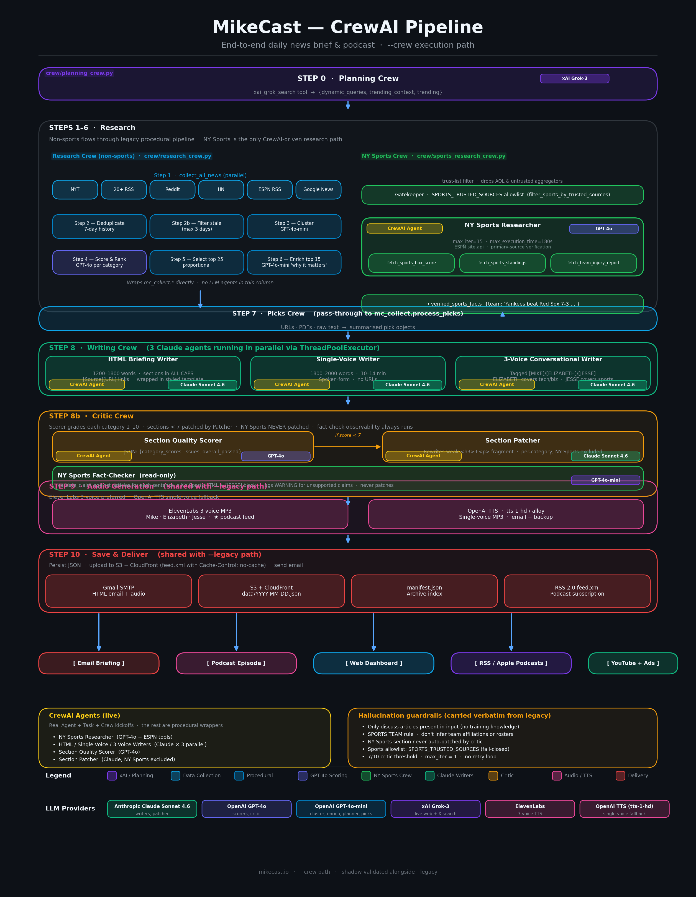
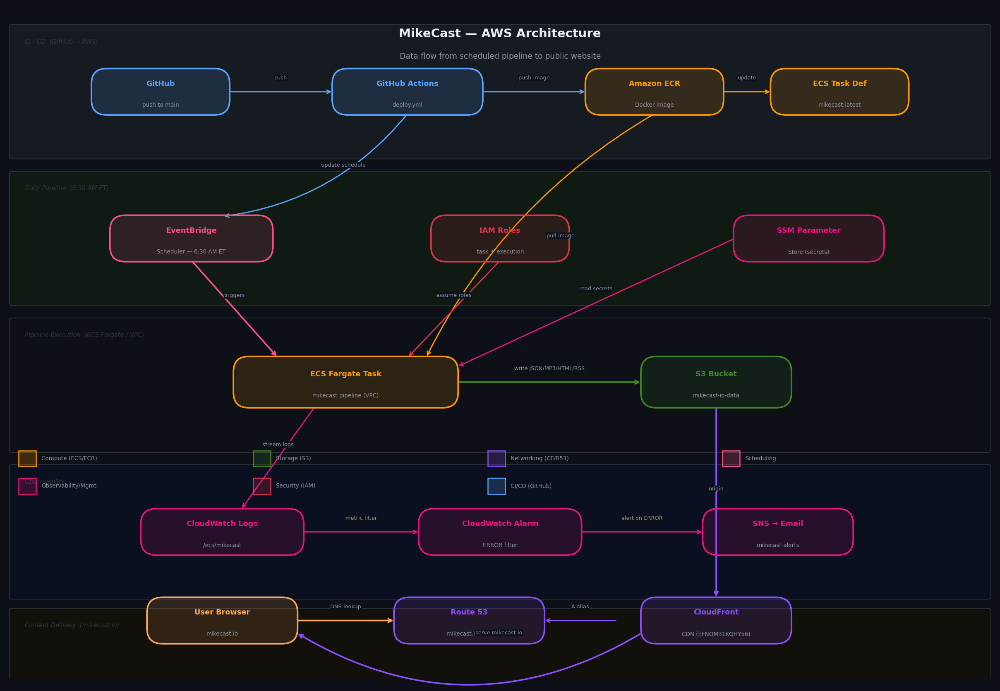

# MikeCast: Daily AI-Powered News Briefing

MikeCast is an automated daily news briefing system. It runs an 11-step pipeline each morning to collect, score, and deliver a personalized news package covering AI/Tech, Business & Markets, key Companies, and NY Sports — as an HTML email, a subscriber newsletter, a podcast, a web dashboard, a YouTube episode, and automatic daily posts to X and Instagram.

## Architecture

The default execution path is the CrewAI agent pipeline (`--crew`). A `--legacy` flag is kept for fast rollback.



### AWS Architecture & Data Flow



## Features

1. **Adaptive Search Planning (xAI Grok)**: Before any news is collected, `mc_plan.py` calls the **xAI Grok API** (`grok-2` model) using its live web search capability to scan what's actually breaking right now. Grok produces two outputs that flow through the rest of the pipeline:

   - **Dynamic search queries** (one set per category): replace the static keyword lists in `mc_config.py` for that run. For example, if Nvidia just announced a GPU, Grok adds a targeted query like `"Nvidia Blackwell launch"` rather than relying on the generic `"Nvidia news today"`.
   - **Trending topics list**: up to 10 stories Grok is highly confident occurred today (it is explicitly instructed to omit anything it isn't sure about). Each topic includes the story, a confidence score, and an X/Twitter search URL.

   These outputs are used downstream in two ways: (1) the dynamic queries drive the Google News + RSS fetch in Step 1, so collection is tuned to today's news rather than evergreen terms; (2) the trending topics are injected into the Step 4 scoring prompts to boost articles that match breaking stories, and into the Step 8 generation prompts as suggested context (labeled "verify before covering" — see Hallucination Mitigations). If `XAI_API_KEY` is not set, Step 0 is skipped gracefully and the pipeline falls back to the static queries in `mc_config.py`.

2. **Multi-Source News Aggregation**: Pulls articles in parallel from:
   - **NYT Top Stories & Article Search APIs**: Authoritative headlines from Technology, Business, Sports, and Home sections.
   - **RSS Feeds**: TechCrunch, Ars Technica, VentureBeat, Wired, MIT Technology Review, CNBC, ESPN (NBA/MLB/NFL/NHL).
   - **Reddit Atom Feeds**: r/MachineLearning, r/artificial, r/technology, r/investing. *(Sports subreddits excluded — fan speculation was a hallucination source.)*
   - **Google News**: Fallback keyword search for broad coverage.
   - **Hacker News**: Top stories via RSS.

3. **Content Deduplication & Clustering**: Maintains a 7-day rolling history (`briefing_history.json`) to skip repeated stories. A `gpt-4o-mini` clustering pass then groups near-duplicate articles before scoring.

4. **AI Scoring & Ranking**: Per-category GPT-4o agents score and rank articles using tailored prompts (e.g., bonus for Yankees/Knicks stories in Sports, penalty for vague AI hype in Tech). Grok's trending context is passed to scoring agents to weight breaking news higher. Stale articles (older than 3 days) are dropped before scoring.

5. **Story Enrichment**: The top 15 articles have their full body text fetched and receive a `gpt-4o-mini` "why it matters" annotation.

6. **"Mike's Picks"**: User-submitted content (URLs, local PDFs, or raw text) queued via `mikes_picks_ingest.py` and included as a dedicated section in every briefing.

7. **Multi-Format Generation** (parallel GPT-4o calls):
   - **HTML Briefing**: Professional email with executive summary, categorized stories, and clickable links.
   - **Single-voice podcast script**: For OpenAI TTS (fallback).
   - **3-voice conversational script**: For ElevenLabs with `[MIKE]`, `[ELIZABETH]`, and `[JESSE]` speaker tags.

8. **Quality Critic Pass**: A GPT-4o critic scores each category section (1–10) on depth, substance, and story count. Sections scoring below 7 are automatically regenerated with targeted prompts. NY Sports is never auto-patched — thin but honest sports coverage is preferable to GPT inventing game results from training knowledge.

9. **Dual-TTS Audio Generation**:
   - **ElevenLabs 3-voice** (preferred): Mike = host, Elizabeth = tech/biz, Jesse = sports. Uses `eleven_multilingual_v2`.
   - **OpenAI TTS** (single voice, "alloy"): Generated only when ElevenLabs is unavailable or fails.
   - The ElevenLabs version is used for the RSS podcast feed when available.
   - **Clean single-stream stitching**: each TTS call returns a self-contained MP3 (its own ID3 + VBR header). Rather than concatenating the raw bytes — which leaves multiple embedded headers mid-stream and makes streaming players (Apple Podcasts, Spotify) mis-estimate the duration and replay the tail — `mc_audio._concat_mp3_segments()` decodes every segment and re-encodes one continuous stream with ffmpeg's concat demuxer. The result has exactly one valid `Xing`/`LAME` header and an accurate duration, then gets loudness-normalized to −16 LUFS and stamped with a `TLEN` tag. If ffmpeg is missing the code falls back to raw concatenation rather than failing.

10. **Delivery & Publishing**:
    - **Email**: HTML briefing in the body, podcast script and audio as attachments, sent via Gmail SMTP to the personal recipient (`GMAIL_TO`).
    - **Newsletter broadcast** (optional, Resend): the same HTML briefing is broadcast to all confirmed public subscribers via the Resend Broadcasts API, with the Apple/Spotify/RSS subscribe row plus a CAN-SPAM footer (postal address + unsubscribe link). Additive to the Gmail send and skipped gracefully when Resend isn't configured. See **Email Newsletter** below.
    - **Daily JSON**: All content saved to `data/YYYY-MM-DD.json` for the dashboard.
    - **Manifest**: `data/manifest.json` updated for dashboard date-picker navigation.
    - **RSS Feed**: `data/feed.xml` updated as a standard podcast RSS 2.0 feed, uploaded to S3 with `Cache-Control: no-cache` so Apple Podcasts and Spotify always fetch the latest version rather than serving a stale CloudFront-cached copy.

11. **Static Dashboard Website**: A responsive dark-themed SPA (`dashboard/`) for browsing briefings by date, with an embedded audio player and collapsible script viewer.

12. **CrewAI agent pipeline (opt-in via `--crew`)**: Steps 0–8b can be executed by [CrewAI](https://github.com/crewAIInc/crewAI) agents instead of the procedural pipeline. A `Planning Crew`, four `Research` agents, a dedicated `NY Sports Research Crew` (Gatekeeper + Researcher with ESPN box-score / standings / injury tools + Fact-Checker), a `Writing Crew` (three Claude writers in parallel), a `Critic Crew` (GPT-4o scorer + Claude patcher), and a `Distribution Crew` (Claude social copywriter, Step 11) replace or extend the matching legacy modules. Steps 9 and 10 (audio + delivery) are unchanged. **The CrewAI path is the default since the cutover** — pass `--legacy` to revert to the procedural pipeline for a single run. See **CrewAI Architecture** below for full details.

13. **Automatic social distribution (X + Instagram)** — Step 11: after delivery, MikeCast auto-posts the day's briefing to **X** ([@mikecastai](https://x.com/mikecastai)) and **Instagram** ([@mikecastai](https://www.instagram.com/mikecastai/)), each linking back to that day's episode.
    - **X**: a "🎙️ MikeCast Daily · {date}" tweet — a Claude-written news hook plus the episode deep link and the Spotify show link (posted via the X API v2, OAuth 1.0a).
    - **Instagram**: a branded **1080×1080 image card** (generated with Pillow) published via the Instagram Graph API two-step container→publish flow, with a matching caption. IG doesn't linkify caption URLs, so the CTA points to the site + "link in bio."
    - **Copy** is written by the new `Distribution Crew` (a Claude social copywriter, hallucination-guarded), with deterministic headers/links/fallbacks added in code so an LLM blip never blocks posting.
    - Each channel skips gracefully with a logged message when its credentials aren't set. See **Social Distribution** below.

14. **First-run-of-day send gating & post editing**:
    - **Idempotent sends** (`mc_dist_state.py`): per-date state at `data/dist/YYYY-MM-DD.json` records which channels (personal email, newsletter, X, Instagram) have already fired, so a `--force` regeneration never re-emails subscribers or re-posts to social. `--force --resend` bypasses the gate.
    - **`?date=YYYY-MM-DD` deep links**: `app.js` opens a specific episode directly (used by every social link).
    - **`mc_edit.py`**: edit/republish a past episode (HTML → JSON + manifest + RSS + CloudFront invalidation) and delete/repost its social posts.
    - **Homepage**: single-row subscribe bar (email signup + Apple/Spotify/RSS/X/Instagram icons in brand colors) with `?date=` deep-link support.

## Pipeline (11 Steps)

```
Step 0   Plan searches       xAI Grok live web search → dynamic queries per category + trending topics list (skipped if XAI_API_KEY unset)
Step 1   Collect news        Parallel fetch from all sources (NYT, RSS, Reddit, Hacker News, Google News)
Step 2   Deduplicate         Skip articles seen in the past 7 days; drop stale articles (>3 days old)
Step 3   Cluster             GPT-4o-mini groups near-duplicate articles
Step 4   Score & rank        Per-category GPT-4o agents score articles (with trending context)
Step 5   Select top 25       Proportional across categories; sports articles filtered to trusted sources
Step 6   Enrich top 15       Fetch full body + "why it matters" via GPT-4o-mini
Step 7   Mike's Picks        Process user-submitted URLs, PDFs, and text
Step 8   Generate content    Parallel: HTML briefing + single-voice script + 3-voice script
Step 8b  Critic pass         GPT-4o scores sections; regenerates weak ones (score < 7); NY Sports never patched
Step 9   Generate audio      ElevenLabs 3-voice (preferred) + OpenAI TTS single-voice fallback; segments stitched into one clean MP3 via ffmpeg concat
Step 10  Save & deliver      JSON → manifest → RSS feed → Gmail email → Resend newsletter broadcast (optional); all sends gated first-run-of-day
Step 11  Social distribution Auto-post to X + Instagram with a deep link back to the episode (optional; skipped if creds unset)
```

## CrewAI Architecture

The default pipeline since the cutover. Run with `--legacy` to revert to the procedural path for a single run. Both produce the same on-disk outputs and share Steps 9 (audio) + 10 (delivery).

```
Planning Crew  →  Research Crew (non-sports)  →  Picks Crew  →  Writing Crew  →  Critic Crew  →  Distribution Crew
   (Step 0)        + NY Sports Research Crew       (Step 7)       (Step 8)        (Step 8b)       (Step 11)
                   (Steps 1–6)                                                    + NY Sports      social copywriter
                                                                                  Fact-Checker     (X + IG copy)
                                                                                  (read-only)
```

**Models used (LiteLLM strings, all overridable via env):**

| Role | Default model | Env var |
|---|---|---|
| HTML / single-voice / 3-voice writers + section patcher + social copywriter | `anthropic/claude-sonnet-4-6` | `CLAUDE_WRITER_MODEL` |
| Per-category scorer, section quality scorer | `openai/gpt-4o` | `OPENAI_SCORER_MODEL`, `OPENAI_CRITIC_MODEL` |
| Picks, planner orchestration, NY Sports fact-checker | `openai/gpt-4o-mini` | `OPENAI_HELPER_MODEL` |

**The NY Sports specialist crew** has tools no other crew can call:
- `fetch_sports_box_score(team)` — most-recent completed game from `site.api.espn.com/.../teams/{team}/schedule`
- `fetch_sports_standings(league)` — full league standings from `site.web.api.espn.com/.../standings`
- `fetch_team_injury_report(team)` — current injury report (league-wide payload filtered by team `displayName`)
- `validate_claim_against_articles(claim, articles)` — GPT-4o-mini structured fact-check used by the read-only Fact-Checker observability pass

The Researcher is capped at `max_iter=15` and `max_execution_time=180` so a rate-limit blip can't loop for 10+ minutes. NY Sports remains in the `NEVER_PATCH_NORMALIZED` set — the critic still refuses to auto-patch that section. The fact-checker runs sentence-by-sentence against `validate_claim_against_articles` for both the HTML NY Sports section AND the `[JESSE]` block of the 3-voice script on every critic pass — unsupported claims are logged at WARNING but never auto-patched.

**Podcast length**: writer Tasks target 6–7 minutes of audio (~900–1000 words total). Per-segment word budgets are in `crew/writing_crew.py`. Adjust both `_single_voice_task` and `_conversational_task` if you want a different length.

**Run a CrewAI briefing:**

```bash
# Requires ANTHROPIC_API_KEY in addition to OPENAI_API_KEY
.venv/bin/python3 mikecast_briefing.py --crew --force
```

**Layout** (added by this migration):

```
crew/
├── __init__.py
├── tools.py              # All CrewAI tools — wraps legacy fetchers + 4 new ESPN/fact-check tools
├── llm.py                # CrewAI LLM factory
├── agents.py             # Agent personas; backstories reuse legacy hallucination guards verbatim
├── context.py            # Re-exports legacy prompt helpers (_build_articles_context, etc.)
├── planning_crew.py      # Step 0
├── research_crew.py      # Steps 1–6 (non-sports)
├── sports_research_crew.py # Steps 1–6 for NY Sports (Gatekeeper + Researcher + Fact-Checker)
├── picks_crew.py         # Step 7
├── writing_crew.py       # Step 8 — 3 Claude writers in parallel
├── critic_crew.py        # Step 8b — Scorer + Patcher (NY Sports never patched)
└── distribution_crew.py  # Step 11 — Claude social copywriter (X post + IG caption)
```

## Hallucination Mitigations

Preventing LLM hallucinations in a fully automated pipeline requires defense at every layer. The following guards are active:

- **CRITICAL RULE in all generation prompts**: Every GPT-4o prompt explicitly prohibits adding facts, names, scores, or events not present in the provided articles.
- **Explicit article counts**: Each category block tells GPT exactly how many articles it has (`"3 articles — discuss ONLY these"`), preventing gap-filling from training knowledge.
- **Stale article filter**: Articles older than 3 days are dropped before generation.
- **Sports trusted-source allowlist** (`SPORTS_TRUSTED_SOURCES` in `mc_config.py`): Sports articles from publishers outside the allowlist (e.g. AOL.com aggregators) are dropped before generation.
- **NY Sports never patched**: `NEVER_PATCH_NORMALIZED = {"ny sports"}` in `mc_critic.py`. When sports coverage is thin, the section stays thin rather than being regenerated with hallucinated content.
- **Two-stage trending topic filter** (`_filter_trending_to_articles` in `mc_generate.py`): Grok trending topics pass through a keyword gate first, then a GPT-4o semantic validation step that checks whether the topic's specific claim is actually supported by the collected articles — not just that a related entity appears somewhere in the corpus.
- **Trending prompt label**: Topics injected into generation prompts are labeled as "suggested — verify before covering," not "confirmed present."
- **Episode description guard**: The episode description prompt explicitly prohibits mentioning anything not stated in the podcast script.
- **Grok grounding instruction**: Grok is instructed to omit any trending story it isn't highly confident actually occurred today.
- **LLMs are never used as article sources**: Grok generates search queries only. All article content comes from real RSS feeds and APIs.

## Project Structure

```
mikecast/
├── mikecast_briefing.py      # Main entry point — orchestrates the full 11-step pipeline
├── mc_config.py              # Configuration, constants, env vars, category definitions
├── mc_plan.py                # xAI Grok adaptive search planning (Step 0)
├── mc_collect.py             # News collection, dedup, clustering, scoring, enrichment (Steps 1–6)
├── mc_generate.py            # GPT-4o content generation: HTML + podcast scripts (Step 8)
├── mc_critic.py              # Post-generation quality critic pass (Step 8b)
├── mc_audio.py               # TTS audio: ElevenLabs 3-voice + OpenAI fallback (Step 9)
├── mc_deliver.py             # Save JSON, manifest, RSS feed, email + Resend newsletter (Step 10)
├── mc_dist_state.py          # Per-date distribution state; first-run-of-day send gating
├── mc_social.py              # X + Instagram posting: card generation, orchestrator, CLI (Step 11)
├── mc_edit.py                # Edit/republish a past episode + delete/repost its social posts
├── mc_utils.py               # Shared helpers (HTTP, JSON, text similarity, CloudFront invalidation)
├── mc_ad.py                  # 30-second vertical video ad generator (Meta/Google formats)
├── mc_youtube.py             # YouTube upload utilities
├── mikes_picks_ingest.py     # CLI to queue URLs, PDFs, or text into Mike's Picks
├── server.py                 # Flask server for local dashboard with /api/manifest
├── test_trending_filter.py   # Regression test for trending topic hallucination filter
├── make_crew_diagram.py      # Generates mikecast_crewai_architecture.png
├── run_mikecast.sh           # Cron wrapper: sources env, runs pipeline, commits + pushes
├── mikes_picks.json          # Queue for user-submitted content
├── briefing_history.json     # Rolling 7-day history of processed articles
├── requirements.txt          # Python dependencies
├── CLAUDE.md                 # Claude Code context and operating constraints
├── index.html                # GitHub Pages entry point (briefing + email signup + social follow icons)
├── subscribe.html            # Dedicated newsletter landing page
├── confirmed.html            # Post-confirmation thank-you page (handles ?error=expired)
├── app.js                    # GitHub Pages dashboard JavaScript
├── signup.js                 # Email-signup handler (shared by index.html + subscribe.html)
├── style.css                 # GitHub Pages dashboard styles
├── assets/                   # Static assets (fonts for video ad generation)
├── lambda/
│   └── newsletter_signup/    # Signup/confirm Lambda (Function URL) between the form and Resend
│       ├── handler.py        # POST /signup + GET /confirm (HMAC double opt-in)
│       ├── requirements.txt  # resend (boto3 is in the Lambda runtime)
│       ├── deploy.sh         # pip install -t build/, zip, update-function-code
│       └── README.md         # IAM role, env vars, Function URL, setup steps
├── dashboard/                # Local dashboard SPA (served by server.py)
│   ├── index.html
│   ├── style.css
│   └── app.js
├── data/                     # Daily JSON files + audio + manifest + RSS + distribution state
│   ├── YYYY-MM-DD.json
│   ├── MikeCast_YYYY-MM-DD.mp3
│   ├── MikeCast_3voice_YYYY-MM-DD.mp3
│   ├── manifest.json
│   ├── feed.xml
│   ├── cover.png
│   ├── dist/YYYY-MM-DD.json   # per-date send state (email/newsletter/X/IG)
│   └── social/               # generated 1080×1080 Instagram cards
└── crew/                     # CrewAI agent pipeline (opt-in via --crew)
    ├── tools.py
    ├── llm.py
    ├── agents.py
    ├── context.py
    ├── planning_crew.py
    ├── research_crew.py
    ├── sports_research_crew.py
    ├── picks_crew.py
    ├── writing_crew.py
    ├── critic_crew.py
    └── distribution_crew.py
```

## Setup and Installation

This project runs locally on Linux (Ubuntu/Debian) with Python 3.12+.

### 1. Clone the Repository

```bash
git clone https://github.com/schwim23/mikecast.git
cd mikecast
```

### 2. Install System Dependencies

```bash
sudo apt install -y python3.12-venv python3-pip poppler-utils
```

`poppler-utils` provides `pdftotext`, required for PDF ingestion in Mike's Picks.

### 3. Create a Virtual Environment and Install Python Dependencies

```bash
python3 -m venv .venv
.venv/bin/pip install -r requirements.txt
.venv/bin/pip install flask  # for local dashboard server
```

### 4. Set Environment Variables

Add the following to both `~/.bashrc` (interactive terminals) and `~/.profile` (login shells and cron):

```bash
# Required
export NYTAPIKEY="your_nyt_api_key"
export OPENAI_API_KEY="your_openai_api_key"
export GMAIL_APP_PASSWORD="your_16_digit_gmail_app_password"
export GMAIL_FROM="sender@gmail.com"
export GMAIL_TO="recipient@example.com"

# Optional — enables ElevenLabs 3-voice podcast (preferred for RSS)
export ELEVENLABS_API_KEY="your_elevenlabs_api_key"
export ELEVENLABS_VOICE_MIKE="voice_id_for_mike"
export ELEVENLABS_VOICE_ELIZABETH="voice_id_for_elizabeth"
export ELEVENLABS_VOICE_JESSE="voice_id_for_jesse"

# Optional — enables xAI Grok adaptive search planning (Step 0)
export XAI_API_KEY="your_xai_api_key"

# Required for the default CrewAI path (--crew). Not needed for a --legacy run.
export ANTHROPIC_API_KEY="your_anthropic_api_key"

# Optional — enables the daily email newsletter broadcast (Resend). When unset,
# the broadcast is skipped and only the personal Gmail send to GMAIL_TO runs.
export RESEND_API_KEY="re_..."
export RESEND_AUDIENCE_ID="your_resend_audience_id"
export RESEND_FROM="MikeCast <mike@mikecast.io>"      # optional; this is the default
export RESEND_REPLY_TO="michael.schwimmer@gmail.com"  # optional; this is the default

# Optional — enables the daily X (Twitter) auto-post (Step 11). OAuth 1.0a,
# "Read and write" app permission. Skipped gracefully when unset.
export X_API_KEY="..."
export X_API_SECRET="..."
export X_ACCESS_TOKEN="..."
export X_ACCESS_TOKEN_SECRET="..."

# Optional — enables the daily Instagram auto-post (Step 11). Meta system-user
# (or long-lived) token + the IG Business account id. Skipped gracefully when unset.
export META_ACCESS_TOKEN="..."
export IG_USER_ID="1784..."

# Optional — CloudFront distribution fronting mikecast.io (used by mc_edit.py to
# invalidate the cache after republishing a past episode). Defaults to the live one.
export CLOUDFRONT_DIST_ID="<CLOUDFRONT_DIST_ID>"

# Optional — enables AWS S3 mode (outputs written to S3 instead of local disk)
export S3_BUCKET="your-s3-bucket-name"

# Optional — enables YouTube upload
export YOUTUBE_CLIENT_SECRETS="/path/to/client_secrets.json"
export YOUTUBE_PRIVACY="public"
```

> **Social credentials:** X needs an X API v2 developer app with OAuth 1.0a "Read and write" keys; Instagram needs a Meta Business app with a system-user (or long-lived) token whose IG Business account is linked to a Facebook Page. Store all six values in SSM Parameter Store and reference them from the ECS task definition's `secrets`. Each channel is skipped gracefully when its credentials are absent.

**Note:** Cron jobs do not source `~/.bashrc`. The `run_mikecast.sh` wrapper explicitly sources `~/.profile`.

Where to get API keys:
- `NYTAPIKEY`: [NYT Developer Portal](https://developer.nytimes.com/)
- `OPENAI_API_KEY`: [OpenAI Platform](https://platform.openai.com/api-keys)
- `GMAIL_APP_PASSWORD`: A 16-digit App Password from Google Account (not your regular password)
- `ELEVENLABS_API_KEY`: [ElevenLabs](https://elevenlabs.io/)
- `XAI_API_KEY`: [xAI](https://x.ai/)
- `ANTHROPIC_API_KEY`: [Anthropic Console](https://console.anthropic.com/) — required for the default `--crew` path
- `RESEND_API_KEY` / `RESEND_AUDIENCE_ID`: [Resend](https://resend.com/) full-access API key + the "MikeCast Daily" audience id. Only needed to enable the newsletter broadcast. See **Email Newsletter** below for the full signup-form + Lambda + DNS setup.
- `S3_BUCKET`: Name of your AWS S3 bucket (must be in us-east-1 or set `AWS_DEFAULT_REGION`). Requires `boto3` and AWS credentials (`~/.aws/credentials` or IAM role).
- `YOUTUBE_CLIENT_SECRETS`: Path to OAuth 2.0 credentials JSON from [Google Cloud Console](https://console.cloud.google.com/) with YouTube Data API v3 enabled.

### 5. Configure Git Credentials (for GitHub Pages auto-push)

```bash
git -C ~/mikecast config credential.helper store
```

Then do one manual push with your GitHub username and a Personal Access Token as the password. Credentials are stored in `~/.git-credentials` for all future automated pushes.

### 6. Test a Manual Run

```bash
source ~/.profile
cd ~/mikecast
.venv/bin/python3 mikecast_briefing.py
```

To force-regenerate today's briefing if one already exists:

```bash
.venv/bin/python3 mikecast_briefing.py --force
```

To run the CrewAI agent pipeline instead of the legacy procedural one (requires `ANTHROPIC_API_KEY`):

```bash
.venv/bin/python3 mikecast_briefing.py --crew --force
```

### 7. Schedule the Daily Cron Job

```bash
crontab -e
```

Current entry (runs at **6:45 AM ET** daily):

```
45 6 * * * /home/mike-schwimmer/mikecast/run_mikecast.sh >> /home/mike-schwimmer/mikecast/mikecast.log 2>&1
```

The `run_mikecast.sh` wrapper:
- Sources `~/.profile` to load environment variables
- Runs `mikecast_briefing.py` with the virtual environment
- Commits and pushes updated data to GitHub (which updates the GitHub Pages dashboard)

## AWS Deployment

The pipeline runs on **AWS ECS Fargate** in addition to the local cron. ECS is the primary production environment; the local cron is a fallback.

### How it works

- **Container image**: stored in Amazon ECR (`<ACCOUNT_ID>.dkr.ecr.us-east-1.amazonaws.com/mikecast`)
- **Scheduler**: EventBridge Scheduler (`mikecast-daily`) triggers the ECS task at **6:30 AM ET** daily
- **Storage**: all pipeline outputs (JSON, audio, manifest, RSS) are written to S3 (`mikecast-io-data`) when `S3_BUCKET` is set
- **Website**: CloudFront serves `mikecast.io` from the S3 bucket

### Deploying code changes

Push to `main` — that's it. The GitHub Actions workflow (`.github/workflows/deploy.yml`) automatically:

1. Builds a new Docker image from `main`
2. Tags it with the commit SHA and pushes to ECR
3. Registers a new ECS task definition revision
4. Updates the EventBridge Scheduler to use the new task definition

The next 6:30 AM run will use the updated image. No manual AWS steps needed.

**Prerequisite:** GitHub Actions secrets must be set at `Settings → Secrets → Actions`:
- `AWS_ACCESS_KEY_ID`
- `AWS_SECRET_ACCESS_KEY`

### Running ECS manually

```bash
# Trigger an immediate run (uses latest task definition — the entrypoint defaults to --crew)
aws ecs run-task \
  --cluster mikecast \
  --task-definition mikecast \
  --launch-type FARGATE \
  --network-configuration 'awsvpcConfiguration={subnets=[<SUBNET_ID>],securityGroups=[<SECURITY_GROUP_ID>],assignPublicIp=ENABLED}' \
  --region us-east-1

# Force-regenerate today's briefing (e.g. after a code fix) on the default crew path.
# Requires ANTHROPIC_API_KEY in SSM Parameter Store (path: /mikecast/ANTHROPIC_API_KEY,
# SecureString) referenced from the task definition's containerDefinitions[0].secrets array.
# Swap --crew for --legacy to force a one-shot rollback run instead.
aws ecs run-task \
  --cluster mikecast \
  --task-definition mikecast \
  --launch-type FARGATE \
  --overrides '{"containerOverrides":[{"name":"mikecast","command":["python","mikecast_briefing.py","--crew","--force"]}]}' \
  --network-configuration 'awsvpcConfiguration={subnets=[<SUBNET_ID>],securityGroups=[<SECURITY_GROUP_ID>],assignPublicIp=ENABLED}' \
  --region us-east-1

# Stream CloudWatch logs
aws logs tail /ecs/mikecast --follow --region us-east-1
```

### Rebuilding the Docker image manually

```bash
# Authenticate with ECR
aws ecr get-login-password --region us-east-1 | \
  docker login --username AWS --password-stdin <ACCOUNT_ID>.dkr.ecr.us-east-1.amazonaws.com

# Build and push
docker build -t mikecast .
docker tag mikecast:latest <ACCOUNT_ID>.dkr.ecr.us-east-1.amazonaws.com/mikecast:latest
docker push <ACCOUNT_ID>.dkr.ecr.us-east-1.amazonaws.com/mikecast:latest
```

The Dockerfile uses `python:3.11-slim` with `ffmpeg`. The `.dockerignore` excludes `data/`, `.venv/`, and logs, keeping the image under 300 MB.

## Usage

### Generating the Daily Briefing

Runs automatically via cron. To run manually:

```bash
source ~/.profile && .venv/bin/python3 mikecast_briefing.py
```

### Adding to "Mike's Picks"

```bash
# Add a URL
.venv/bin/python3 mikes_picks_ingest.py --url "https://example.com/article"

# Add a local PDF
.venv/bin/python3 mikes_picks_ingest.py --pdf "/path/to/paper.pdf"

# Add raw text with a title
.venv/bin/python3 mikes_picks_ingest.py --text "Some interesting analysis..." --title "My Title"
```

Picks are consumed and cleared during Step 7 of the next briefing run.

### Viewing the Dashboard

#### Option A: mikecast.io (Remote, Auto-Updated)

After each run, the cron script pushes data to GitHub, which triggers a sync to AWS S3 + CloudFront. The public site is served from CloudFront at:

**URL:** `https://mikecast.io/`

Full archive navigation, audio player, and article links all work on the live site.

#### Option B: Local Server (Full Functionality)

```bash
.venv/bin/python3 server.py
```

Then open `http://localhost:8080` in your browser. The local Flask server exposes `/api/manifest`, enabling full archive date-picker navigation. Run in `screen` or `tmux` for persistence.

### Subscribing to the Podcast RSS Feed

```
https://mikecast.io/data/feed.xml
```

Add this URL to any podcast app (Overcast, Pocket Casts, Castro, etc.) to receive new episodes automatically. The feed is also available on Apple Podcasts and Spotify.

The feed is served with `Cache-Control: no-cache` so podcast crawlers always fetch fresh content. If a platform lags (Apple typically re-polls within a few hours; Spotify can take up to 24 hours), you can request a manual refresh from [Apple Podcasts Connect](https://podcastsconnect.apple.com).

### Subscribing by Email (Newsletter)

Visitors can subscribe to a daily email of the same briefing at the inline form on `mikecast.io` or the dedicated `mikecast.io/subscribe.html` landing page. Signup is **double opt-in** and powered by [Resend](https://resend.com/).

```
browser form ──POST /signup──▶ Lambda ──Resend.Emails.send──▶ confirmation email
                                                                     │
user clicks confirm ──GET /confirm?t=…──▶ Lambda ──Resend.Contacts.create──▶ audience
                                                  └──302──▶ mikecast.io/confirmed.html

ECS daily run ──▶ mc_deliver.send_newsletter_broadcast(html) ──Resend Broadcasts──▶ all confirmed subscribers
```

- A thin Lambda (`lambda/newsletter_signup/`, Function URL) sits between the static form and Resend so the API key never reaches the browser. It HMAC-signs a 24h token, emails the confirm link, and on confirmation adds the contact to the Resend audience.
- The daily broadcast (`send_newsletter_broadcast` in `mc_deliver.py`, called right after the Gmail send) reuses the exact HTML briefing plus the Apple/Spotify/RSS subscribe row and a CAN-SPAM footer (postal address + Resend's auto-injected unsubscribe link). It is additive — the personal Gmail send to `GMAIL_TO` is unchanged — and skips gracefully when `RESEND_API_KEY` / `RESEND_AUDIENCE_ID` are unset.

**One-time setup (manual):**

1. Create a Resend account; add `mikecast.io` as a sending domain and add the SPF/DKIM/DMARC DNS records to the Route53 hosted zone; wait for "Verified".
2. Create an audience named "MikeCast Daily" (note its id) and a **full-access** API key.
3. Store secrets in SSM: `/mikecast/RESEND_API_KEY` (SecureString), `/mikecast/RESEND_AUDIENCE_ID` (String), `/mikecast/SIGNUP_HMAC_SECRET` (SecureString). Add `RESEND_API_KEY` + `RESEND_AUDIENCE_ID` to the ECS task definition's `secrets`, and `RESEND_FROM` to its `environment`.
4. Deploy the Lambda (see `lambda/newsletter_signup/README.md`), create its Function URL with CORS for `https://mikecast.io`, and set that URL as both the Lambda's `CONFIRM_BASE_URL` env var and `MIKECAST_SIGNUP_ENDPOINT` in `signup.js`.
5. Fill in the real postal address in the CAN-SPAM footer (`_NEWSLETTER_FOOTER` in `mc_deliver.py`) before the first broadcast.

### Social Distribution (X + Instagram)

Step 11 auto-posts the day's briefing to **X** and **Instagram**, each linking to that episode. It runs at the end of the daily pipeline and is also usable standalone via `mc_social.py`:

```bash
# Preview copy + card for a date without posting (writes the IG card locally)
.venv/bin/python3 mc_social.py --date 2026-07-05 --dry-run

# Post now (both channels); --only x / --only ig to limit; --force re-posts
.venv/bin/python3 mc_social.py --date 2026-07-05 --only x --force

# Delete a tweet
.venv/bin/python3 mc_social.py --delete-tweet <tweet_id>
```

- **X**: a `🎙️ MikeCast Daily · {date}` tweet — Claude-written news hook + the episode deep link (`mikecast.io/?date=…`) + the Spotify show link, fit to 280 weighted chars (each URL counts as 23).
- **Instagram**: a branded 1080×1080 card (Pillow) uploaded to `s3://…/data/social/` for a public URL, then published via the Graph API container→publish flow, with a caption mirroring the tweet. IG captions don't linkify URLs, so the CTA is `mikecast.io` + "link in bio".
- **Copy** comes from `crew/distribution_crew.py` (a Claude social copywriter). Headers, links, length-fitting, and a deterministic fallback template are handled in code, so an LLM outage never blocks posting.
- **Gating**: `mc_dist_state.py` records each channel's send per date, so daily `--force` reruns don't double-post. `--resend` on the main pipeline forces re-sends.

See the environment-variables section above for the required X and Instagram credentials.

### Editing / Reposting a Past Episode

`mc_edit.py` edits a published episode and manages its social posts, operating strictly on `--date`:

```bash
mc_edit.py show          --date 2026-07-01                    # print meta + HTML
mc_edit.py set-html      --date 2026-07-01 --file fixed.html  # replace the briefing HTML
mc_edit.py regen         --date 2026-07-01                    # re-run the writing crew (HTML only)
mc_edit.py publish       --date 2026-07-01                    # push JSON to S3 + rebuild manifest/RSS + invalidate CloudFront
mc_edit.py repost-social --date 2026-07-01 [--only x|ig] [--reuse-copy]
mc_edit.py delete-social --date 2026-07-01 [--only x]
```

Edits preserve `episode_num`/`audio_file` and stamp `edited_at`. X reposts delete-then-repost via the API; Instagram has no delete API, so `repost-social`/`delete-social` prompt you to remove the old post in the app first.

### Generating a YouTube Episode

`mc_youtube.py` converts the daily audio to a 1920×1080 video with the cover image and uploads it to YouTube via the Data API v3.

```bash
# First-time auth (interactive, one-time setup)
.venv/bin/python3 mc_youtube.py --auth

# Upload today's episode
.venv/bin/python3 mc_youtube.py
```

Requires `YOUTUBE_CLIENT_SECRETS` env var pointing to your OAuth 2.0 credentials JSON from Google Cloud Console. Optional: `YOUTUBE_PRIVACY` ("public", "unlisted", or "private"; defaults to "public").

### Generating Social Video Ads

`mc_ad.py` generates 30-second 9:16 vertical MP4 ads (1080×1920) for Meta/Google Reels and Stories, using the 3 ElevenLabs voices with animated subtitles.

```bash
# Use today's episode
.venv/bin/python3 mc_ad.py

# Specific date
.venv/bin/python3 mc_ad.py --date 2026-04-06

# Preview script without rendering
.venv/bin/python3 mc_ad.py --dry-run
```

### Monitoring

```bash
tail -f mikecast.log
```

## Configuration

Edit `mc_config.py` to customize:
- **`CATEGORIES`**: The search topics and Google News queries per category.
- **`CATEGORY_SCORER_PROMPTS`**: The LLM scoring criteria for each category.
- **`NYT_SECTIONS` / `NYT_SEARCH_QUERIES`**: NYT API sections and search terms.
- **`TECH_RSS_FEEDS` / `WIRE_RSS_FEEDS` / `CNBC_RSS_FEEDS` / `ESPN_RSS_FEEDS` / `REDDIT_FEEDS`**: RSS and Reddit sources.
- **`SPORTS_TRUSTED_SOURCES`**: Publisher allowlist for NY Sports articles.
- **`SOURCE_TIERS`**: Source credibility rankings passed to scoring agents.

## Claude Code Integration

This project uses Claude Code with custom slash commands stored in `.claude/commands/`:

- **`/mc-run`**: Check if today's briefing exists, then run (or force-regenerate) the pipeline and show the run summary.
- **`/mc-debug`**: Triage a failed or incomplete run — checks logs, environment variables, output files, and briefing history integrity.
- **`/mc-picks`**: Add a URL, PDF, or pasted text to the Mike's Picks queue.

Operating constraints and hallucination guard rules for Claude Code are documented in `CLAUDE.md`.
