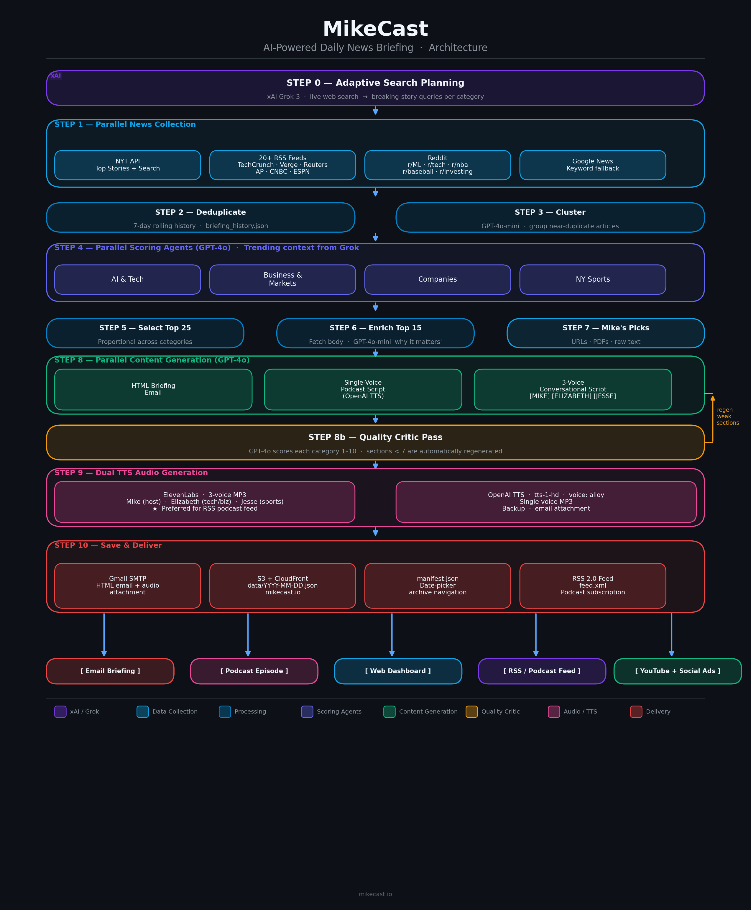

# MikeCast: Daily AI-Powered News Briefing

MikeCast is an automated daily news briefing system. It runs a 10-step pipeline each morning to collect, score, and deliver a personalized news package covering AI/Tech, Business & Markets, key Companies, and NY Sports — as an HTML email, a podcast, a web dashboard, and a YouTube episode.

## Architecture



### AWS Architecture & Data Flow


## Features

1. **Adaptive Search Planning (xAI Grok)**: Before any news is collected, `mc_plan.py` calls the **xAI Grok API** (`grok-2` model) using its live web search capability to scan what's actually breaking right now. Grok produces two outputs that flow through the rest of the pipeline:

   - **Dynamic search queries** (one set per category): replace the static keyword lists in `mc_config.py` for that run. For example, if Nvidia just announced a GPU, Grok adds a targeted query like `"Nvidia Blackwell launch"` rather than relying on the generic `"Nvidia news today"`.
   - **Trending topics list**: up to 10 stories Grok is highly confident occurred today (it is explicitly instructed to omit anything it isn't sure about). Each topic includes the story, a confidence score, and an X/Twitter search URL.

   These outputs are used downstream in two ways: (1) the dynamic queries drive the Google News + RSS fetch in Step 1, so collection is tuned to today's news rather than evergreen terms; (2) the trending topics are injected into the Step 4 scoring prompts to boost articles that match breaking stories, and into the Step 8 generation prompts as suggested context (labeled "verify before covering" — see Hallucination Mitigations). If `XAI_API_KEY` is not set, Step 0 is skipped gracefully and the pipeline falls back to the static queries in `mc_config.py`.

2. **Multi-Source News Aggregation**: Pulls articles in parallel from:
   - **NYT Top Stories & Article Search APIs**: Authoritative headlines from Technology, Business, Sports, and Home sections.
   - **RSS Feeds**: TechCrunch, Ars Technica, VentureBeat, Wired, MIT Technology Review, CNBC, ESPN (NBA/MLB/NFL/NHL).
   - **Reddit Atom Feeds**: r/MachineLearning, r/artificial, r/technology, r/investing. *(Sports subreddits excluded — fan speculation was a hallucination source.)*
   - **Google News**: Fallback keyword search for broad coverage.
   - **Hacker News**: Top stories via RSS.

3. **Content Deduplication & Clustering**: Maintains a 7-day rolling history (`briefing_history.json`) to skip repeated stories. A `gpt-4o-mini` clustering pass then groups near-duplicate articles before scoring.

4. **AI Scoring & Ranking**: Per-category GPT-4o agents score and rank articles using tailored prompts (e.g., bonus for Yankees/Knicks stories in Sports, penalty for vague AI hype in Tech). Grok's trending context is passed to scoring agents to weight breaking news higher. Stale articles (older than 3 days) are dropped before scoring.

5. **Story Enrichment**: The top 15 articles have their full body text fetched and receive a `gpt-4o-mini` "why it matters" annotation.

6. **"Mike's Picks"**: User-submitted content (URLs, local PDFs, or raw text) queued via `mikes_picks_ingest.py` and included as a dedicated section in every briefing.

7. **Multi-Format Generation** (parallel GPT-4o calls):
   - **HTML Briefing**: Professional email with executive summary, categorized stories, and clickable links.
   - **Single-voice podcast script**: For OpenAI TTS (fallback).
   - **3-voice conversational script**: For ElevenLabs with `[MIKE]`, `[ELIZABETH]`, and `[JESSE]` speaker tags.

8. **Quality Critic Pass**: A GPT-4o critic scores each category section (1–10) on depth, substance, and story count. Sections scoring below 7 are automatically regenerated with targeted prompts. NY Sports is never auto-patched — thin but honest sports coverage is preferable to GPT inventing game results from training knowledge.

9. **Dual-TTS Audio Generation**:
   - **ElevenLabs 3-voice** (preferred): Mike = host, Elizabeth = tech/biz, Jesse = sports. Uses `eleven_multilingual_v2`.
   - **OpenAI TTS** (single voice, "alloy"): Generated only when ElevenLabs is unavailable or fails.
   - The ElevenLabs version is used for the RSS podcast feed when available.

10. **Delivery & Publishing**:
    - **Email**: HTML briefing in the body, podcast script and audio as attachments, sent via Gmail SMTP.
    - **Daily JSON**: All content saved to `data/YYYY-MM-DD.json` for the dashboard.
    - **Manifest**: `data/manifest.json` updated for dashboard date-picker navigation.
    - **RSS Feed**: `data/feed.xml` updated as a standard podcast RSS 2.0 feed.

11. **Static Dashboard Website**: A responsive dark-themed SPA (`dashboard/`) for browsing briefings by date, with an embedded audio player and collapsible script viewer.

## Pipeline (10 Steps)

```
Step 0   Plan searches       xAI Grok live web search → dynamic queries per category + trending topics list (skipped if XAI_API_KEY unset)
Step 1   Collect news        Parallel fetch from all sources (NYT, RSS, Reddit, Hacker News, Google News)
Step 2   Deduplicate         Skip articles seen in the past 7 days; drop stale articles (>3 days old)
Step 3   Cluster             GPT-4o-mini groups near-duplicate articles
Step 4   Score & rank        Per-category GPT-4o agents score articles (with trending context)
Step 5   Select top 25       Proportional across categories; sports articles filtered to trusted sources
Step 6   Enrich top 15       Fetch full body + "why it matters" via GPT-4o-mini
Step 7   Mike's Picks        Process user-submitted URLs, PDFs, and text
Step 8   Generate content    Parallel: HTML briefing + single-voice script + 3-voice script
Step 8b  Critic pass         GPT-4o scores sections; regenerates weak ones (score < 7); NY Sports never patched
Step 9   Generate audio      ElevenLabs 3-voice (preferred) + OpenAI TTS single-voice fallback
Step 10  Save & deliver      JSON → manifest → RSS feed → email
```

## Hallucination Mitigations

Preventing LLM hallucinations in a fully automated pipeline requires defense at every layer. The following guards are active:

- **CRITICAL RULE in all generation prompts**: Every GPT-4o prompt explicitly prohibits adding facts, names, scores, or events not present in the provided articles.
- **Explicit article counts**: Each category block tells GPT exactly how many articles it has (`"3 articles — discuss ONLY these"`), preventing gap-filling from training knowledge.
- **Stale article filter**: Articles older than 3 days are dropped before generation.
- **Sports trusted-source allowlist** (`SPORTS_TRUSTED_SOURCES` in `mc_config.py`): Sports articles from publishers outside the allowlist (e.g. AOL.com aggregators) are dropped before generation.
- **NY Sports never patched**: `NEVER_PATCH_NORMALIZED = {"ny sports"}` in `mc_critic.py`. When sports coverage is thin, the section stays thin rather than being regenerated with hallucinated content.
- **Two-stage trending topic filter** (`_filter_trending_to_articles` in `mc_generate.py`): Grok trending topics pass through a keyword gate first, then a GPT-4o semantic validation step that checks whether the topic's specific claim is actually supported by the collected articles — not just that a related entity appears somewhere in the corpus.
- **Trending prompt label**: Topics injected into generation prompts are labeled as "suggested — verify before covering," not "confirmed present."
- **Episode description guard**: The episode description prompt explicitly prohibits mentioning anything not stated in the podcast script.
- **Grok grounding instruction**: Grok is instructed to omit any trending story it isn't highly confident actually occurred today.
- **LLMs are never used as article sources**: Grok generates search queries only. All article content comes from real RSS feeds and APIs.

## Project Structure

```
mikecast/
├── mikecast_briefing.py      # Main entry point — orchestrates the full 10-step pipeline
├── mc_config.py              # Configuration, constants, env vars, category definitions
├── mc_plan.py                # xAI Grok adaptive search planning (Step 0)
├── mc_collect.py             # News collection, dedup, clustering, scoring, enrichment (Steps 1–6)
├── mc_generate.py            # GPT-4o content generation: HTML + podcast scripts (Step 8)
├── mc_critic.py              # Post-generation quality critic pass (Step 8b)
├── mc_audio.py               # TTS audio: ElevenLabs 3-voice + OpenAI fallback (Step 9)
├── mc_deliver.py             # Save JSON, manifest, RSS feed, send email (Step 10)
├── mc_utils.py               # Shared utility helpers (HTTP, JSON, text similarity)
├── mc_ad.py                  # 30-second vertical video ad generator (Meta/Google formats)
├── mc_youtube.py             # YouTube upload utilities
├── mikes_picks_ingest.py     # CLI to queue URLs, PDFs, or text into Mike's Picks
├── server.py                 # Flask server for local dashboard with /api/manifest
├── test_trending_filter.py   # Regression test for trending topic hallucination filter
├── make_diagram.py           # Generates mikecast_architecture.png
├── run_mikecast.sh           # Cron wrapper: sources env, runs pipeline, commits + pushes
├── mikes_picks.json          # Queue for user-submitted content
├── briefing_history.json     # Rolling 7-day history of processed articles
├── requirements.txt          # Python dependencies
├── CLAUDE.md                 # Claude Code context and operating constraints
├── index.html                # GitHub Pages entry point
├── app.js                    # GitHub Pages dashboard JavaScript
├── style.css                 # GitHub Pages dashboard styles
├── assets/                   # Static assets (fonts for video ad generation)
├── dashboard/                # Local dashboard SPA (served by server.py)
│   ├── index.html
│   ├── style.css
│   └── app.js
└── data/                     # Daily JSON files + audio + manifest + RSS
    ├── YYYY-MM-DD.json
    ├── MikeCast_YYYY-MM-DD.mp3
    ├── MikeCast_3voice_YYYY-MM-DD.mp3
    ├── manifest.json
    ├── feed.xml
    └── cover.png
```

## Setup and Installation

This project runs locally on Linux (Ubuntu/Debian) with Python 3.12+.

### 1. Clone the Repository

```bash
git clone https://github.com/schwim23/mikecast.git
cd mikecast
```

### 2. Install System Dependencies

```bash
sudo apt install -y python3.12-venv python3-pip poppler-utils
```

`poppler-utils` provides `pdftotext`, required for PDF ingestion in Mike's Picks.

### 3. Create a Virtual Environment and Install Python Dependencies

```bash
python3 -m venv .venv
.venv/bin/pip install -r requirements.txt
.venv/bin/pip install flask  # for local dashboard server
```

### 4. Set Environment Variables

Add the following to both `~/.bashrc` (interactive terminals) and `~/.profile` (login shells and cron):

```bash
# Required
export NYTAPIKEY="your_nyt_api_key"
export OPENAI_API_KEY="your_openai_api_key"
export GMAIL_APP_PASSWORD="your_16_digit_gmail_app_password"
export GMAIL_FROM="sender@gmail.com"
export GMAIL_TO="recipient@example.com"

# Optional — enables ElevenLabs 3-voice podcast (preferred for RSS)
export ELEVENLABS_API_KEY="your_elevenlabs_api_key"
export ELEVENLABS_VOICE_MIKE="voice_id_for_mike"
export ELEVENLABS_VOICE_ELIZABETH="voice_id_for_elizabeth"
export ELEVENLABS_VOICE_JESSE="voice_id_for_jesse"

# Optional — enables xAI Grok adaptive search planning (Step 0)
export XAI_API_KEY="your_xai_api_key"

# Optional — enables AWS S3 mode (outputs written to S3 instead of local disk)
export S3_BUCKET="your-s3-bucket-name"

# Optional — enables YouTube upload
export YOUTUBE_CLIENT_SECRETS="/path/to/client_secrets.json"
export YOUTUBE_PRIVACY="public"
```

**Note:** Cron jobs do not source `~/.bashrc`. The `run_mikecast.sh` wrapper explicitly sources `~/.profile`.

Where to get API keys:
- `NYTAPIKEY`: [NYT Developer Portal](https://developer.nytimes.com/)
- `OPENAI_API_KEY`: [OpenAI Platform](https://platform.openai.com/api-keys)
- `GMAIL_APP_PASSWORD`: A 16-digit App Password from Google Account (not your regular password)
- `ELEVENLABS_API_KEY`: [ElevenLabs](https://elevenlabs.io/)
- `XAI_API_KEY`: [xAI](https://x.ai/)
- `S3_BUCKET`: Name of your AWS S3 bucket (must be in us-east-1 or set `AWS_DEFAULT_REGION`). Requires `boto3` and AWS credentials (`~/.aws/credentials` or IAM role).
- `YOUTUBE_CLIENT_SECRETS`: Path to OAuth 2.0 credentials JSON from [Google Cloud Console](https://console.cloud.google.com/) with YouTube Data API v3 enabled.

### 5. Configure Git Credentials (for GitHub Pages auto-push)

```bash
git -C ~/mikecast config credential.helper store
```

Then do one manual push with your GitHub username and a Personal Access Token as the password. Credentials are stored in `~/.git-credentials` for all future automated pushes.

### 6. Test a Manual Run

```bash
source ~/.profile
cd ~/mikecast
.venv/bin/python3 mikecast_briefing.py
```

To force-regenerate today's briefing if one already exists:

```bash
.venv/bin/python3 mikecast_briefing.py --force
```

### 7. Schedule the Daily Cron Job

```bash
crontab -e
```

Current entry (runs at **6:45 AM ET** daily):

```
45 6 * * * /home/mike-schwimmer/mikecast/run_mikecast.sh >> /home/mike-schwimmer/mikecast/mikecast.log 2>&1
```

The `run_mikecast.sh` wrapper:
- Sources `~/.profile` to load environment variables
- Runs `mikecast_briefing.py` with the virtual environment
- Commits and pushes updated data to GitHub (which updates the GitHub Pages dashboard)

## AWS Deployment

The pipeline runs on **AWS ECS Fargate** in addition to the local cron. ECS is the primary production environment; the local cron is a fallback.

### How it works

- **Container image**: stored in Amazon ECR (`602039469166.dkr.ecr.us-east-1.amazonaws.com/mikecast`)
- **Scheduler**: EventBridge Scheduler (`mikecast-daily`) triggers the ECS task at **6:30 AM ET** daily
- **Storage**: all pipeline outputs (JSON, audio, manifest, RSS) are written to S3 (`mikecast-io-data`) when `S3_BUCKET` is set
- **Website**: CloudFront serves `mikecast.io` from the S3 bucket

### Deploying code changes

Push to `main` — that's it. The GitHub Actions workflow (`.github/workflows/deploy.yml`) automatically:

1. Builds a new Docker image from `main`
2. Tags it with the commit SHA and pushes to ECR
3. Registers a new ECS task definition revision
4. Updates the EventBridge Scheduler to use the new task definition

The next 6:30 AM run will use the updated image. No manual AWS steps needed.

**Prerequisite:** GitHub Actions secrets must be set at `Settings → Secrets → Actions`:
- `AWS_ACCESS_KEY_ID`
- `AWS_SECRET_ACCESS_KEY`

### Running ECS manually

```bash
# Trigger an immediate run (uses latest task definition)
aws ecs run-task \
  --cluster mikecast \
  --task-definition mikecast \
  --launch-type FARGATE \
  --network-configuration 'awsvpcConfiguration={subnets=[subnet-086fe88cca1a9de84],securityGroups=[sg-0b075c1eea308976b],assignPublicIp=ENABLED}' \
  --region us-east-1

# Stream CloudWatch logs
aws logs tail /ecs/mikecast --follow --region us-east-1
```

### Rebuilding the Docker image manually

```bash
# Authenticate with ECR
aws ecr get-login-password --region us-east-1 | \
  docker login --username AWS --password-stdin 602039469166.dkr.ecr.us-east-1.amazonaws.com

# Build and push
docker build -t mikecast .
docker tag mikecast:latest 602039469166.dkr.ecr.us-east-1.amazonaws.com/mikecast:latest
docker push 602039469166.dkr.ecr.us-east-1.amazonaws.com/mikecast:latest
```

The Dockerfile uses `python:3.11-slim` with `ffmpeg`. The `.dockerignore` excludes `data/`, `.venv/`, and logs, keeping the image under 300 MB.

## Usage

### Generating the Daily Briefing

Runs automatically via cron. To run manually:

```bash
source ~/.profile && .venv/bin/python3 mikecast_briefing.py
```

### Adding to "Mike's Picks"

```bash
# Add a URL
.venv/bin/python3 mikes_picks_ingest.py --url "https://example.com/article"

# Add a local PDF
.venv/bin/python3 mikes_picks_ingest.py --pdf "/path/to/paper.pdf"

# Add raw text with a title
.venv/bin/python3 mikes_picks_ingest.py --text "Some interesting analysis..." --title "My Title"
```

Picks are consumed and cleared during Step 7 of the next briefing run.

### Viewing the Dashboard

#### Option A: mikecast.io (Remote, Auto-Updated)

After each run, the cron script pushes data to GitHub, which triggers a sync to AWS S3 + CloudFront. The public site is served from CloudFront at:

**URL:** `https://mikecast.io/`

Full archive navigation, audio player, and article links all work on the live site.

#### Option B: Local Server (Full Functionality)

```bash
.venv/bin/python3 server.py
```

Then open `http://localhost:8080` in your browser. The local Flask server exposes `/api/manifest`, enabling full archive date-picker navigation. Run in `screen` or `tmux` for persistence.

### Subscribing to the Podcast RSS Feed

```
https://mikecast.io/data/feed.xml
```

Add this URL to any podcast app (Overcast, Pocket Casts, Castro, etc.) to receive new episodes automatically. The feed is also available on Apple Podcasts and Spotify.

### Generating a YouTube Episode

`mc_youtube.py` converts the daily audio to a 1920×1080 video with the cover image and uploads it to YouTube via the Data API v3.

```bash
# First-time auth (interactive, one-time setup)
.venv/bin/python3 mc_youtube.py --auth

# Upload today's episode
.venv/bin/python3 mc_youtube.py
```

Requires `YOUTUBE_CLIENT_SECRETS` env var pointing to your OAuth 2.0 credentials JSON from Google Cloud Console. Optional: `YOUTUBE_PRIVACY` ("public", "unlisted", or "private"; defaults to "public").

### Generating Social Video Ads

`mc_ad.py` generates 30-second 9:16 vertical MP4 ads (1080×1920) for Meta/Google Reels and Stories, using the 3 ElevenLabs voices with animated subtitles.

```bash
# Use today's episode
.venv/bin/python3 mc_ad.py

# Specific date
.venv/bin/python3 mc_ad.py --date 2026-04-06

# Preview script without rendering
.venv/bin/python3 mc_ad.py --dry-run
```

### Monitoring

```bash
tail -f mikecast.log
```

## Configuration

Edit `mc_config.py` to customize:
- **`CATEGORIES`**: The search topics and Google News queries per category.
- **`CATEGORY_SCORER_PROMPTS`**: The LLM scoring criteria for each category.
- **`NYT_SECTIONS` / `NYT_SEARCH_QUERIES`**: NYT API sections and search terms.
- **`TECH_RSS_FEEDS` / `WIRE_RSS_FEEDS` / `CNBC_RSS_FEEDS` / `ESPN_RSS_FEEDS` / `REDDIT_FEEDS`**: RSS and Reddit sources.
- **`SPORTS_TRUSTED_SOURCES`**: Publisher allowlist for NY Sports articles.
- **`SOURCE_TIERS`**: Source credibility rankings passed to scoring agents.

## Claude Code Integration

This project uses Claude Code with custom slash commands stored in `.claude/commands/`:

- **`/mc-run`**: Check if today's briefing exists, then run (or force-regenerate) the pipeline and show the run summary.
- **`/mc-debug`**: Triage a failed or incomplete run — checks logs, environment variables, output files, and briefing history integrity.
- **`/mc-picks`**: Add a URL, PDF, or pasted text to the Mike's Picks queue.

Operating constraints and hallucination guard rules for Claude Code are documented in `CLAUDE.md`.
